# Duo Fit

A 2 in 1 fitness app built with Flutter, capable of running on iOS and Android.

Inspiration taken from MyFitnessPal and Strong Workout apps.

## Splash screen

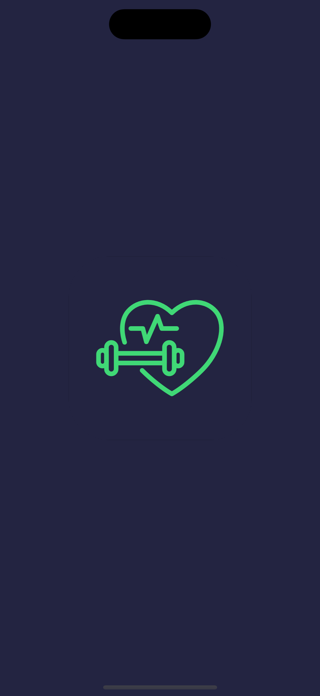

## Welcome / auth pages 

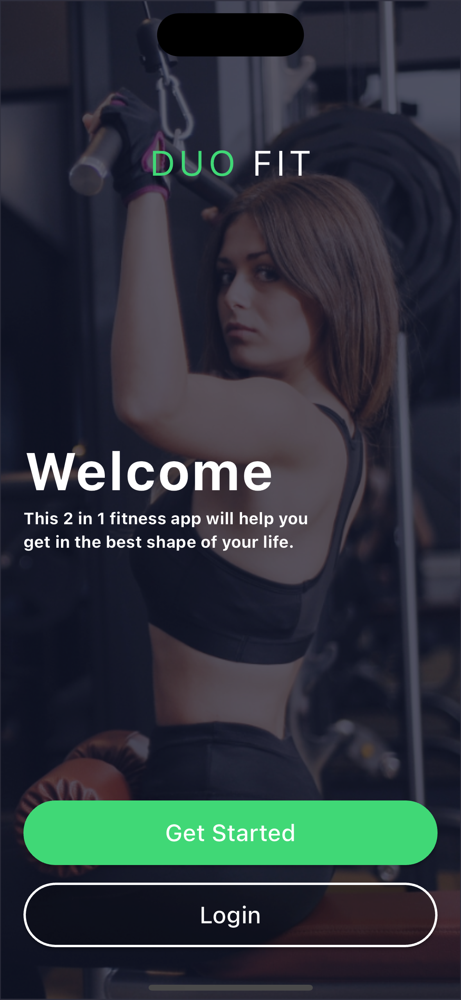 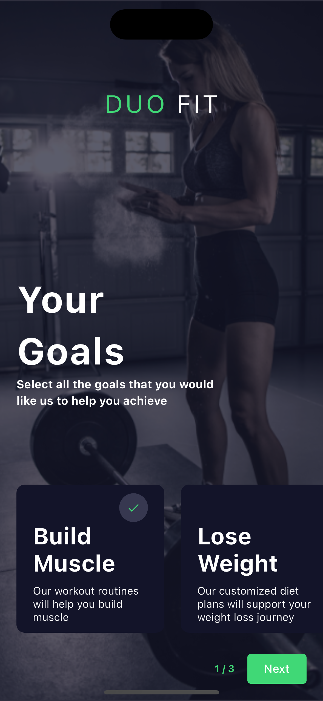 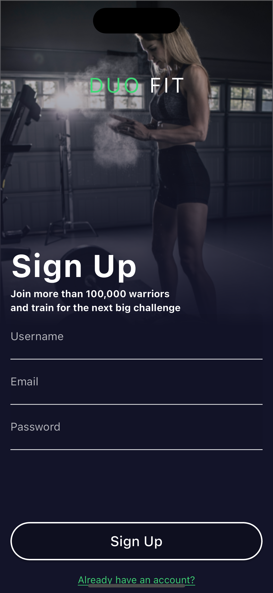 
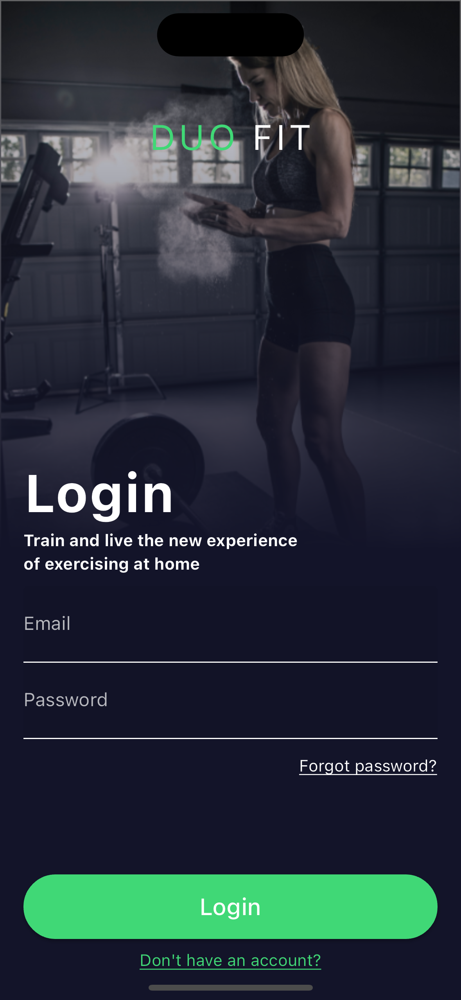 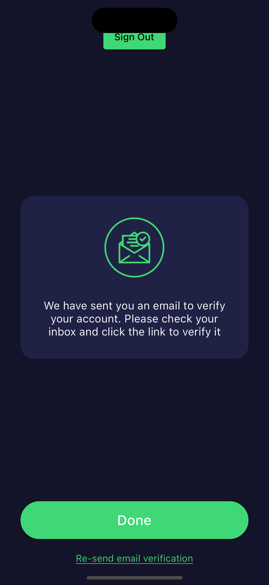 

## Home page -> Foods

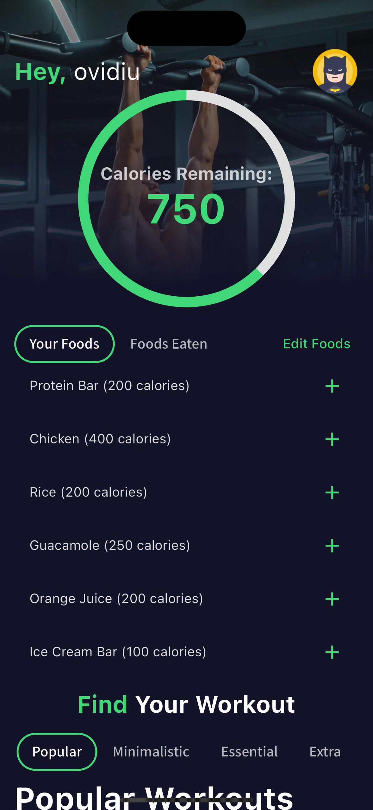 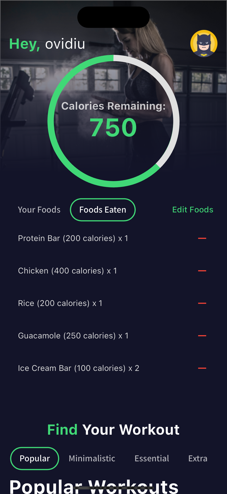 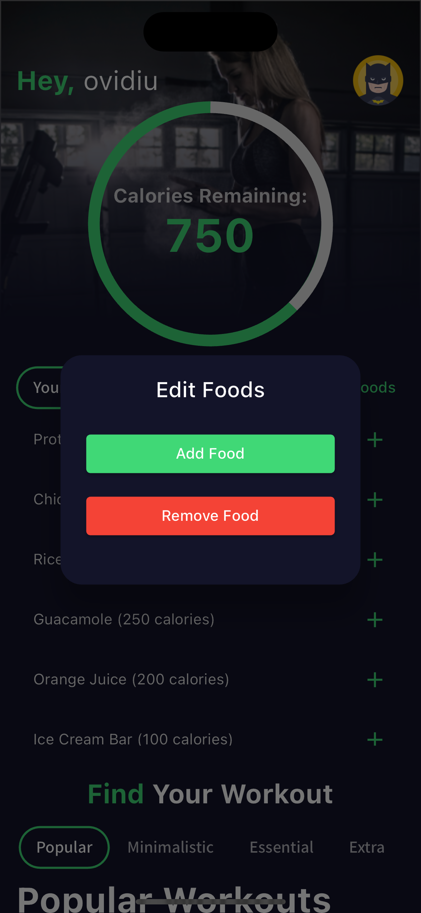 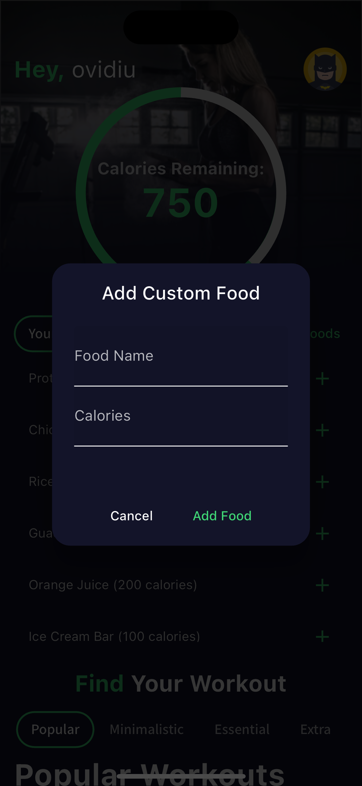 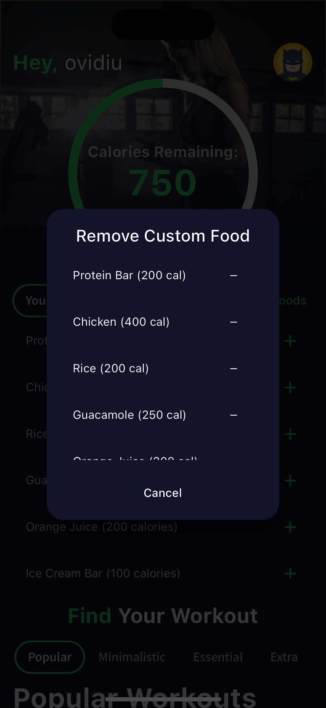  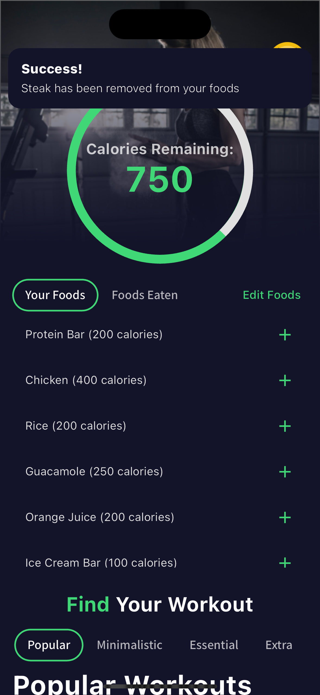

## Home page -> Workouts

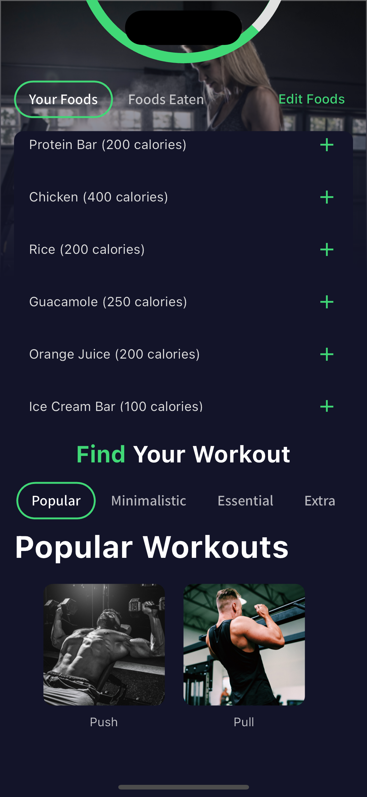 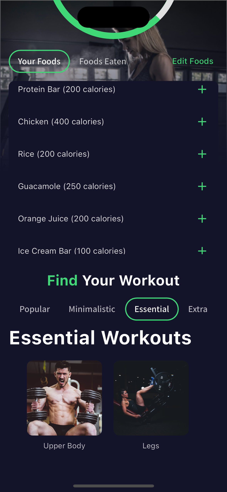 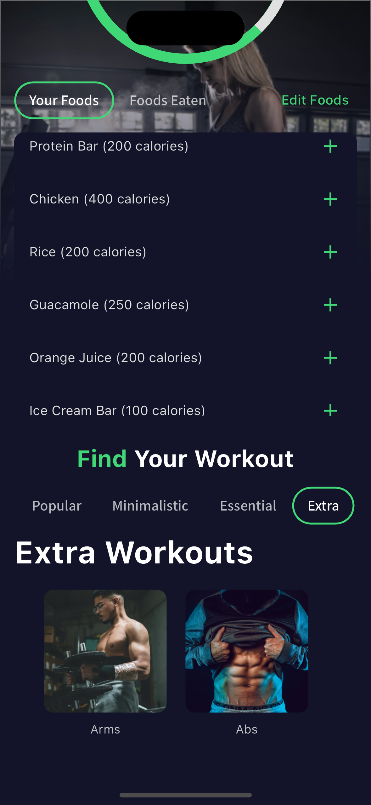

## User profile
  

## Getting Started

This project is a starting point for a Flutter application.

A few resources to get you started if this is your first Flutter project:

- [Lab: Write your first Flutter app](https://docs.flutter.dev/get-started/codelab)
- [Cookbook: Useful Flutter samples](https://docs.flutter.dev/cookbook)

For help getting started with Flutter development, view the
[online documentation](https://docs.flutter.dev/), which offers tutorials,
samples, guidance on mobile development, and a full API reference.
